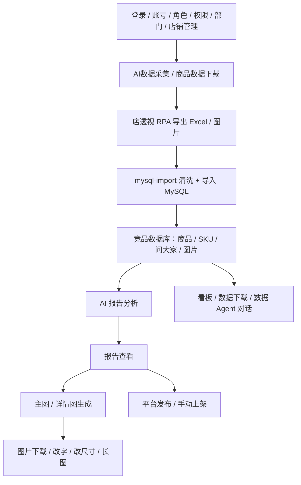
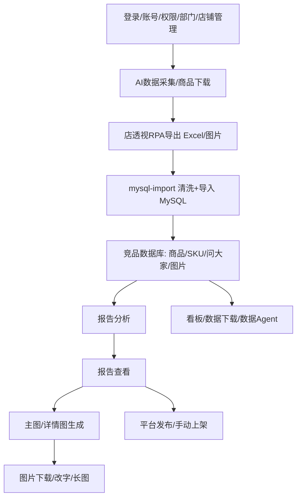

# 旧系统业务逻辑梳理（2026-09-13）

> 来源：旧 `app/`、`backend/server.js`、`skills/` 页面与脚本现状，用于对照新方案迁移范围。

## 主流程

## 分支说明

### 1. 数据采集

- `AIDataCollection`：填写竞品关键词、采集数量，启动店透视 RPA 脚本。
- `DataDownload`：填写商品、价格区间、TopN，启动 RPA 下载，下载后可自动入库。
- RPA 脚本：`skills/diantoushi-product-research` 在淘宝/天猫浏览器中操作店透视扩展，导出商品数据、SKU 预览、问大家、商品图/详情图 Excel 和图片。
- 导出文件收集到桌面目录，再交给 `mysql-import`。

### 2. 数据入库

- `clean_data.py`：清洗商品、SKU、问大家 Excel，提取内嵌图片。
- `load_to_mysql.py`：写入 MySQL 的 `crawl_job`、`product_snapshot`、`product_sku_snapshot`、`product_qa_snapshot`、`media_asset`、`product_page_image_asset` 等表。
- 失败/缺失问大家等情况记录 partial 状态，不阻塞商品与 SKU 入库。

### 3. 报告分析

- `AnalysisReport`：选择已采集集合，支持“快速模式”和完整模式。
- 后端 `aiMarketAnalysis.js` 调用豆包 Ark / OpenRouter / DeepSeek：
  - 单品主图 Vision 分析
  - 价格区间划分
  - 整体竞品报告生成
- 结果写入 `market_analysis_run` 与单品主图分析表，前端 `AnalysisReportView` 展示报告。
- `DataAgentChat` 基于已采集数据和报告进行对话。

### 4. 图片生成

- 报告卖点回传给生图页面。
- `APlusDetail` / 主图工作流：整理商品信息 → 生成模块策略/提示词 → 调用 OpenRouter 或 Ark 生图。
- 输出主图、详情图、场景图等，可批量下载、改字、改尺寸、拼接长图。
- 旧图片资产落在 `app/public/generated/product-sets`，未接入对象存储。

### 5. 平台发布

- `ProductManagement` / `ManualListing`：选择商品、图片和平台类目，进行发布。
- 淘宝等开放平台能力走旧 `taobaoTopClient.js`；非开放平台以手动发布为主。

### 6. 管理能力

- 账号、角色、部门、店铺、菜单权限等由旧 `app/src/server` 各管理模块维护。
- 用户登录由旧 `backend/server.js` 签发会话 Cookie。

## 旧架构的关键特征

- 前端（Vite）直接代理 `/api` 到旧 backend；RPA 仍保留在前端本地服务层。
- Python 脚本直连 MySQL（`pymysql`），运行时建表。
- AI 调用集中在 `app/src/server/aiMarketAnalysis.js`、`arkImageGeneration.js` 等模块。
- 生成的图片、报告、采集文件大量保存在本机目录，缺少统一资产存储。
- 任务没有统一 Job/队列，报告生成通过旧 job 状态文件轮询推进。

