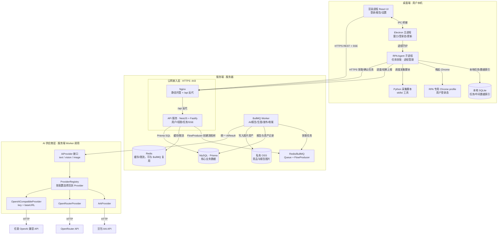

# 电商竞品分析系统：桌面端 + 服务端架构

> 任务：2026-09-10-桌面端与服务端架构方案
> 范围：桌面端（Electron + RPA Agent）与服务端（NestJS + MySQL）的完整重构；取代 `2026-09-07-系统架构重构与前后端分离` 的纯单机取向。

## 一、业务场景树

```text
电商竞品分析系统（桌面端 + 服务端）
├─ A 桌面应用（Electron）
│  ├─ A1 electron-vite 工程与主进程壳 —— 本次做
│  ├─ A2 渲染进程：React UI（登录/报告/设置） —— 本次做
│  ├─ A3 preload 安全桥与 IPC —— 本次做
│  ├─ A4 electron-builder + GitHub Actions 多平台打包与自动更新 —— 本次做
│  ├─ A5 本地配置/token 存储（safeStorage + electron-store） —— 本次做
│  ├─ A6 Python 运行时内置与首次 RPA 登录引导 —— 本次做
│  └─ A7 依赖安装与运行环境探测（Node/pnpm/Chrome/Python/Prisma/Docker） —— 本次做
├─ B RPA Agent（桌面端子进程）
│  ├─ B1 RPA Agent 任务领取与执行（服务端分配 + HTTPS 领取） —— 本次做
│  ├─ B2 启动 RPA 专用 Chrome profile（CDP 端口契约 + 用户登录态） —— 本次做
│  ├─ B3 Python 采集脚本进程管理 —— 本次做
│  ├─ B4 采集中间数据缓存与本地清理 —— 本次做
│  ├─ B5 Agent 本地 SQLite 任务与中间数据索引 —— 本次做
│  └─ B6 Excel 导入通道（mysql-import 清洗后提交服务端） —— 本次做
├─ C 服务端 API（NestJS + Fastify）
│  ├─ C1 用户/角色/权限/租户管理 —— 本次做
│  ├─ C2 任务创建与 FlowProducer 投递 —— 本次做
│  ├─ C3 AI 分析（统一 AiProvider + 密钥集中服务端） —— 本次做
│  ├─ C4 报告生成与查询 —— 本次做
│  ├─ C5 平台适配器与淘宝 —— 本次做
│  ├─ C6 DTO 校验、统一错误、健康检查 —— 本次做
│  ├─ C7 SSE 进度推送 —— 本次做
│  ├─ C8 FlowProducer 流程树、轻量状态机与阶段进度 —— 本次做
│  ├─ C9 Agent 注册/领取/心跳/租约/外部完成契约 —— 本次做
│  ├─ C10 结果人工审核（采纳/不采纳/重新生成） —— 本次做
│  ├─ C11 数据导入 API（mysql-import 结构化提交通道） —— 本次做
│  ├─ C12 StorageDriver 存储抽象（开发本地目录 / 线上 OSS） —— 本次做
│  └─ C13 AI 供应商注册表（Ark / OpenRouter / OpenAI 兼容端点 key+URL） —— 本次做
├─ D 数据与基础设施
│  ├─ D1 MySQL（Prisma：用户/权限/任务/报告/审计） —— 本次做
│  ├─ D2 Redis（BullMQ Queue/FlowProducer/缓存/限流） —— 本次做
│  ├─ D3 OSS 图片资产（服务端，厂商/region/bucket 待补充） —— 本次做
│  ├─ D4 Nginx + PM2 服务端部署 —— 本次做
│  ├─ D5 BullMQ Worker（AI/报告/生图/发布/收尾） —— 本次做
│  └─ D6 可配置自动更新源（主源待最终选型） —— 本次做
├─ T 测试与质量
│  ├─ T1 服务端 Jest 单元/集成 —— 本次做
│  ├─ T2 桌面端 Vitest/Playwright E2E —— 本次做
│  └─ T3 端到端联调（Agent→服务端→报告→生图→发布） —— 本次做
└─ X 明确排除
   ├─ X1 纯单机/无服务端模式 —— 本次不做（已被本方案取代）
   ├─ X2 桌面端 SQLite 承担核心业务数据（用户/权限/报告） —— 本次不做
   ├─ X3 云端 RPA 集群 —— 本次不做
   ├─ X4 微服务/Kubernetes/灰度 —— 本次不做
   ├─ X5 多端数据自动同步（云盘式） —— 本次不做
   ├─ X6 自研 DAG 工作流引擎 —— 本次不做（由 BullMQ FlowProducer + 轻量状态机承担）
   ├─ X7 旧 MySQL 数据迁移/回刷 —— 本次不做（从 0 重新开发）
   └─ X8 采集中途人工验证 —— 本次不做（仅结果阶段审核）
```

## 二、目标架构拓扑

> 交互式架构图产物：[架构图.html](file:///Users/zxh/work/code/ecommerce-competitor-analysis/docs/开发任务/2026-09-10-桌面端与服务端架构方案/架构图/架构图.html)
> 浅色预览截图：[架构图.visual-check.1440x900.light.png](file:///Users/zxh/work/code/ecommerce-competitor-analysis/docs/开发任务/2026-09-10-桌面端与服务端架构方案/架构图/架构图.visual-check.1440x900.light.png)
> 深色预览截图：[架构图.visual-check.1440x900.dark.png](file:///Users/zxh/work/code/ecommerce-competitor-analysis/docs/开发任务/2026-09-10-桌面端与服务端架构方案/架构图/架构图.visual-check.1440x900.dark.png)
>
> 以本 Markdown 为当前架构事实来源；HTML/JSON/截图产物需在本版方案定稿后重新生成。



边界：桌面端不直连 MySQL/Redis，也不持有 OSS 长期凭据；桌面端通过 REST/SSE 与服务端协作，图片开发环境落项目内本地目录，线上经服务端签发的预签名 URL 直传 OSS；服务端不唤起用户浏览器；RPA 结构化采集结果上报服务端后由服务端 AI 处理；核心数据只存服务端。

## 三、端到端数据流

### 1. 分析任务

```text
桌面端 UI 提交任务
 → 服务端鉴权、校验 DTO、权限
 → 创建任务快照（业务唯一键幂等，状态 queued）并经 FlowProducer 投递流程树
 → 轻量状态机按 queued/collecting/uploading/analyzing/reporting 推进
 → Agent 通过 claim 接口领取 desktop-rpa 子任务，写入本地 SQLite 索引并执行
 → 唤起 Chrome + Python 采集
 → 图片按策略预签名直传 OSS，结构化结果上报服务端
 → 采集遇验证码/风控直接失败，用户处理后重新重试，不设置中途挂起
 → 服务端 BullMQ Worker 通过统一 AiProvider 执行 AI 分析（密钥在服务端）并生成报告
 → 报告入 MySQL，资产引用入 generated_assets
 → flow-finalizer 收尾并更新任务状态
 → SSE 推送终态，桌面端刷新
 → 按配置创建图片生成/平台发布执行实例
```

### 2. 图片资产

```text
开发环境：文件落项目内本地目录（LocalStorageDriver）；线上：预签名 PUT URL → 直传 OSS
→ confirm 后服务端校验并落库
AI 生成图 → 开发环境写本地目录，线上服务端直接写 OSS
→ generated_assets 记录 storageKey/mimeType/size/runId/sourceUrl
→ GET /api/assets/:assetId 服务端鉴权输出
```

### 3. 用户管理

```text
管理员（网页或桌面端）在服务端创建用户
→ 分配角色/权限/租户/店铺范围
→ 用户在桌面端登录获取 JWT
→ 服务端统一鉴权与数据隔离
```

### 4. 业务执行实例流程树（示例）

第一版按真实业务场景使用对应的固定流程树模板：分析、图片生成、平台发布各一棵；FlowProducer 提供基础组合能力，但不开放业务级自由组树：

```text
分析实例
flow-finalizer（收尾）
└─ report
   └─ analyze
      └─ collect（Agent 外部完成 + OSS 上传）

图片生成实例
flow-finalizer（收尾）
└─ review
   └─ generate
      └─ prompt

平台发布实例
flow-finalizer（收尾）
└─ submit
   └─ upload-assets
```

### 5. 下游任务衔接

```text
分析任务 flow-finalizer 收尾
  → 按配置创建图片生成执行实例
  → prompt → generate → review
  → 图片资产写入 OSS / generated_assets
  → 按配置创建平台发布执行实例
  → upload-assets → submit
  → 更新平台发布结果与任务终态
```

### 7. AI 供应商调用（统一 Provider）

```text
Worker 业务任务
 → AiAdapter 按能力调用（generateText / analyzeImage / generateImage）
 → ProviderRegistry 按配置选择活跃 Provider
 → ArkProvider / OpenRouterProvider / OpenAICompatibleProvider
 → 返回统一 AiResult + raw_payload
 → AiUsageLog 按 attemptKey 记录审计与幂等
```

其中，`OpenAICompatibleProvider` 用于第三方“key + baseURL + model”调用，通过统一 HTTP 协议接入任意 OpenAI 兼容端点；key 和 baseURL 只存服务端环境变量或加密配置，不下发桌面端、不写入日志。

### 6. 数据导入（Excel / 旧 mysql-import 收编）

```text
桌面端用户上传/选择店透视导出文件
 → Agent 本地运行清洗脚本（内置 Python）
 → 生成结构化 JSON 与文件引用
 → 提交 POST /api/collection-jobs/:id/results（可选预签名上传图片）
 → 服务端校验/去重/写快照表/归档 OSS
 → 由分析任务继续走后续 AI 报告流程
```

## 四、核心状态机

### 1. 分析任务（MySQL 存业务快照，轻量状态机驱动）

```text
queued → collecting → uploading → analyzing → reporting
                                   ├→ success
                                   ├→ failure
                                   └→ cancelled

断线/失败：任务进入 failure，由用户点击重试，并带检查点从失败阶段续跑；已完成的外部付费调用不重复执行
```

### 2. 认证

```text
anonymous → authenticated → token_expired → logged_out
```

长效 Access Token 存服务端签发，桌面端 `safeStorage` 加密后写入 electron-store；401 清态回登录页。

### 3. Agent 生命周期

```text
idle → running(Chrome/Python) → uploading → done | error | cancelled
```

### 4. 图片生成任务（下游可选）

```text
queued → prompting → generating → reviewing → success / failure / cancelled
```

### 5. 平台发布任务（下游可选）

```text
queued → uploading_assets → submitting_listing → success / failure / cancelled
```

## 五、唯一权威判据表

| 状态/能力 | 唯一权威判据 | 本地验证 |
|---|---|---|
| 服务端就绪 | `GET /api/health` 200，MySQL/Redis up | curl |
| BullMQ 就绪 | Redis/BullMQ（Queue + FlowProducer）Worker 注册对应任务队列 | 健康检查/日志 |
| 登录成功 | 返回 Access Token，桌面端可保存 | API 测试 |
| 用户管理 | 服务端可创建/禁用用户，权限生效 200/403 | API 测试 |
| 任务创建 | 任务表唯一 jobId + 状态 queued，幂等唯一键 | 并发测试 |
| 任务被领取 | Agent claim 后 `AgentAssignment` 生效，同一 Agent 仅一个活动任务 | API/并发测试 |
| Agent 租约 | heartbeat 续租、断租后任务 failure、不自动转移 | 断网/故障演练 |
| 外部完成 | complete 后 FlowProducer 父任务继续，子任务状态 completed | 集成测试 |
| Agent 本地队列 | 拉取任务入 SQLite 索引，重启后重新领取或失败重试 | 重启恢复测试 |
| 工作流执行 | FlowProducer 流程树 + 轻量状态机按阶段推进，非法转移被拒绝 | FlowProducer/状态机测试 |
| 流程树收尾 | flow-finalizer 读取子任务结果并更新 MySQL success/failure | 集成测试 |
| 图片生成流程 | prompt → generate → review（结果阶段人工审核）流程树可跑通（Mock AI/存储） | 集成测试 |
| 平台发布流程 | upload-assets → submit 流程树可跑通（平台 Mock） | 集成测试 |
| 任务完成 | 状态 success 且报告/资产 ID 非空 | 集成测试 |
| 任务失败 | 状态 failure 且 errorCode/errorMessage 非空 | 故障样例 |
| 任务失败重试 | 从 checkpointStage 续跑，已成功 AI 调用不重复调用、不重复扣费 | 故障样例 |
| RPA 唤起浏览器 | Agent 进程启动 RPA 专用 profile（首次应用内人工登录），保留登录态 | 本机窗口/进程检查 |
| 结果人工审核 | review 节点支持采纳/不采纳/重新生成；采纳继续，重新生成新建批次，不采纳结束当前资产 | API/UI 测试 |
| 重新生成上限 | regenerate 次数受上限约束，超限后任务进入 failure | 集成测试 |
| 数据导入 | mysql-import 结构化结果经导入 API 落库，快照表可查 | API/集成测试 |
| Agent 断线 | 任务进入 failure/等待，由用户重试 | 断网演练 |
| SSE 进度 | fetch 流式 `text/event-stream`，携带 Bearer，含 id/type/data 与终态 | SSE 测试 |
| 报告落库 | MySQL 报告记录非空，可查询 | 集成测试 |
| 图片落库 | 开发环境本地目录写入成功；线上 OSS 预签名上传成功 + generated_assets 记录 + `/api/assets/:id` 可读 | API 测试 |
| AI 审计 | 每次调用有 ai_usage_logs 记录（含失败） | 数据库查询 |
| AI 供应商切换 | 改配置切换 ark/openrouter/openai-compatible，同一能力调用链不变 | 配置/集成测试 |
| 日志脱敏 | 日志含 requestId/jobId，无 Token/Key 明文 | 日志检查 |
| 打包产物 | GitHub Actions 产出 macOS dmg 与 Windows exe，均可安装启动 | 产物验证 |
| 自动更新 | 新版本发布后桌面端可下载更新且保留数据 | 更新演练 |
| 端到端 | Agent→服务端→AI→报告→图片生成→平台发布全链路通过 | E2E 联调 |
