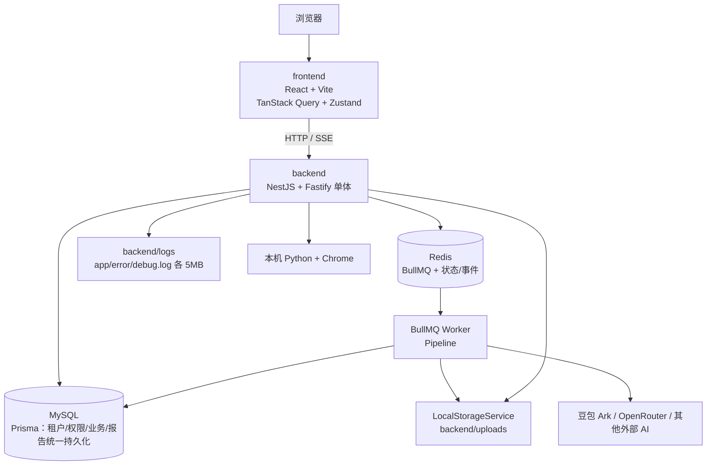

# 本地系统架构重构与前后端分离

> ⚠️ **已被取代**：本目录为纯本地/单机方案，已被 `2026-09-10-桌面端与服务端架构方案` 取代（桌面端 + 服务端形态）。保留仅供历史参考。
> 任务：2026-09-07-系统架构重构与前后端分离
> 范围：**仅本地首次开发环境**
> 原则：全新逻辑、全新数据库、一次性完成；不处理线上部署，不兼容旧实现。
> 线上部署另见：`../归档/2026-09-08-线上部署方案设计/`

## 一、业务场景树

```text
本地电商竞品分析系统重构
├─ A 工程拆分
│  ├─ A1 frontend：React + Vite SPA —— 本次做
│  ├─ A2 backend：NestJS + Fastify 单体 —— 本次做
│  ├─ A3 Vite 仅负责前端开发与 /api 代理 —— 本次做
│  └─ A4 根级 pnpm workspace 统一依赖与命令 —— 本次做
├─ B 后端基础能力
│  ├─ B1 长效 JWT Access Token 认证（localStorage 持久化） —— 本次做
│  ├─ B2 菜单/按钮/部门/店铺权限 —— 本次做
│  ├─ B3 Prisma 数据访问与迁移 —— 本次做
│  ├─ B4 BullMQ + Redis 异步任务 —— 本次做
│  ├─ B5 SSE 进度推送与状态查询 —— 本次做
│  ├─ B6 本地文件 StorageService —— 本次做
│  ├─ B7 DTO 校验、统一错误、日志、健康检查 —— 本次做
│  └─ B8 RPA 宿主机进程管理 —— 本次做
├─ C 业务模块
│  ├─ C1 竞品分析报告 —— 本次做
│  ├─ C2 爆品主图/套图 —— 本次做
│  ├─ C3 AI 数据智能体 —— 本次做
│  ├─ C4 平台与淘宝 —— 本次做
│  └─ C5 RPA 采集 —— 本次做
├─ E 测试与质量
│  ├─ E1 前端 Vitest + React Testing Library —— 本次做
│  ├─ E2 后端 Jest 单元/集成 —— 本次做
│  └─ E3 browser-use 前端 E2E（封装为 skill） —— 本次做
└─ D 明确排除
   ├─ D1 线上 Nginx/PM2/RDS/OSS/SSL —— 本次不做
   ├─ D2 旧数据库迁移与旧 API 兼容 —— 本次不做
   ├─ D3 灰度、双跑、微服务、Kubernetes、Next.js —— 本次不做
   └─ D4 云端 RPA 集群 —— 本次不做
```

工程组织：仓库根目录即工程根，使用 pnpm workspace 管理 `frontend/` 与 `backend/`；不额外增加外层 `app/` 目录，不引入 Next.js 或多余后端框架。根级 `package.json` 提供 `pnpm setup`、`pnpm dev`、`pnpm build` 等统一命令，`skills/` 作为非 Node 的 Python/RPA/浏览器测试工具目录。

## 二、目标架构拓扑



边界：前端不连接 MySQL/Redis/文件系统；后端是唯一业务 API；本地 MySQL 和 Redis 由 Docker 提供；Python/Chrome 由后端受控调用。

## 三、端到端数据流

### 1. 报告任务

```text
前端提交参数
 → ReportController 校验 DTO、身份、权限
 → 事务创建 analysis_run/job（状态 queued）
 → BullMQ 投递 runId（只传引用，不传大 JSON）
 → Worker 执行 Pipeline Steps
 → 结果写 MySQL，生成图片写 LocalStorage
 → 更新 job 状态并记录 job_events
 → SSE 推送实时事件
 → 前端收到终态后刷新 Query；断线时 GET job 状态恢复
```

### 2. 图片资产

```text
AI 返回 URL/base64
 → Worker 下载或解码
 → LocalStorageService 写入 backend/uploads
 → generated_assets 保存 storageKey、mimeType、size
 → GET /api/assets/:assetId 由后端输出文件
```

商品原始图片只保存外部 URL；本轮不上传 OSS。线上 Storage 驱动另行设计。

## 四、核心状态机

### 1. 异步任务

```text
start → queued → active → success
                    ├→ failure
                    ├→ cancelled
                    └→ timeout
```

唯一事实源：`analysis_jobs`/业务任务表中的状态；Redis Pub/Sub 或 SSE 只是通知，不是事实源。

### 2. 认证

```text
anonymous → authenticated → token_expired → logged_out
```

长效 Access Token 写入 Zustand 并持久化到 `localStorage`；页面刷新后前端自动恢复，Axios 携带 Bearer Token；过期或 401 时清态跳登录页。本地与线上统一采用该方案，不实现 Refresh Token。

## 五、唯一权威判据表

| 状态/能力 | 唯一权威判据 | 本地验证 |
|---|---|---|
| 后端就绪 | `GET /api/health` 返回 200，MySQL/Redis 均为 up | curl/集成测试 |
| 登录成功 | 返回 Access Token，且已写入 localStorage | API 测试 |
| 页面刷新恢复 | F5 后 Axios 自动携带 Token，无需重新登录 | 前端 E2E |
| 登出清态 | 登出后 localStorage Token 被清除并跳转登录页 | 前端 E2E |
| 权限生效 | 后端 Guard 根据数据库权限返回 200 或 403 | 越权测试 |
| 任务已创建 | `analysis_jobs` 有唯一 `jobId` 且状态为 queued | 数据库查询 |
| 任务完成 | job 状态 success 且结果关联 ID 非空 | 集成测试 |
| 任务失败 | job 状态 failure 且 errorCode/errorMessage 非空 | 故障样例 |
| 任务幂等 | 相同业务唯一键只产生一个 active job | 并发测试 |
| SSE 有效 | 响应为 `text/event-stream`，事件含 id/type/data | SSE 测试 |
| SSE 恢复 | 断线后通过 job 状态接口得到最新状态 | 集成测试 |
| 图片落盘 | `generated_assets` 有记录且 `/api/assets/:id` 可读取 | 文件/API 测试 |
| 数据库初始化 | Prisma migration 和 seed 成功 | 本地命令 |
| RPA 停止 | 任务状态变更为 cancelled，子进程被回收 | 本机进程检查 |
| AI 审计 | 每次调用有 `ai_usage_logs` 记录，失败也记录 | 数据库查询 |
| 日志可观测 | 单条日志含 requestId/jobId，且无明文密码/Key | 日志检查 |
| Worker 恢复 | Worker 重启后异常 `active` 任务按超时/重试规则收敛到明确终态 | 重启恢复测试 |
| 前端单元测试 | `pnpm --filter frontend test` 通过 | Vitest |
| 后端单元/集成测试 | `pnpm --filter backend test` 通过 | Jest |
| 前端 E2E | browser-use 跑通登录/权限/报告关键流程 | skill |

## 六、本地启动与验收入口

```bash
pnpm setup        # 一键：起 docker + 装依赖 + migrate + seed
pnpm dev          # 一键：同时启动 backend + frontend
pnpm --filter backend test      # 后端单测/集成
pnpm --filter frontend test     # 前端单测/组件
```

最终验收必须覆盖：登录、权限、报告任务、队列消费、SSE、图片保存与访问、RPA 启停、AI 审计、单元测试、browser-use E2E 和前端构建。
