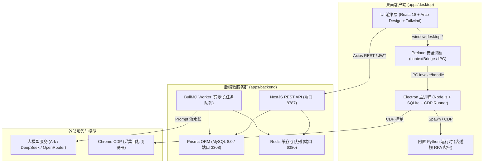

# 一、全局架构概览与设计思想

## 1. 系统形态
本项目采用 **原生桌面端应用（Electron + React） + 分布式服务端（NestJS + MySQL + Redis/BullMQ）** 的混合形态：

---

## 2. 核心分工与职责边界

### 桌面端（`apps/desktop`）
- **产品界面唯一宿主**：业务 UI 全量运行在桌面端渲染层，无独立的浏览器端 Web 站点；
- **本地系统级操作**：
  - 触发本地 Chrome DevTools Protocol (CDP) 驱动真实浏览器；
  - 店透视 RPA 爬虫自动化采集；
  - 任务运行实时日志流展示与本地工作目录管理；
  - 本地 SQLite 缓存与脱机查看历史抓取快照；
  - 图片/视频素材本地离线合成与排版。

### 服务端（`apps/backend`）
- **业务权威数据中心**：
  - 企业多租户隔离体系（Tenant Isolation）；
  - 细粒度 RBAC 权限体系与 JWT 会话签发；
  - 分布式异步长任务队列（BullMQ + Redis）；
  - 大模型 Prompt 工程流水线（价格带聚类、卖点提炼、A+ 图文生成）；
  - 统一大模型路由（LLM Provider Router，适配火山方舟 Ark、DeepSeek、OpenRouter 等）；
  - 竞品主档与资产云端同步。
